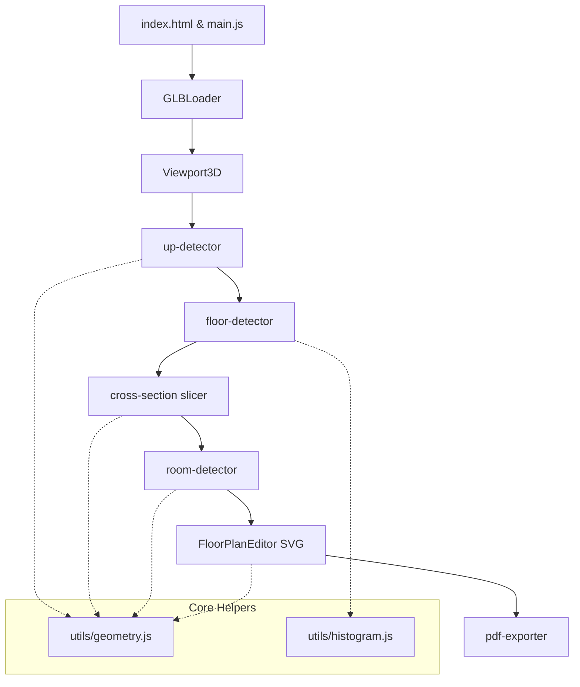

# Architectural Specification — FloorPlan Extractor

This document specifies the software architecture, modular structure, and core algorithms of the FloorPlan Extractor application.

---

## System Architecture

The application is structured as a client-side wizard interface. The pipeline flows linearly through 5 stages, orchestrated by `src/main.js` and managing a single global application state.

---

## File and Module Structure

- **`index.html`**: Host structure for the 5-step wizard screens, viewport containers, toolbars, and controls.
- **`src/main.js`**: App entry point. Maintains application state and transitions between wizard steps.
- **`src/glb-loader.js`**: Loads the GLB binary using Three.js `GLTFLoader`. Traverse meshes, computes bounding boxes, and extracts vertex coordinates/indices in world-space coordinates.
- **`src/viewport-3d.js`**: Handles WebGL rendering (using Three.js) for the 3D model orientation screen (Step 2) and the floor levels preview screen (Step 3).
- **`src/up-detector.js`**: Heuristic model to detect which coordinate axis (+X, -X, +Y, -Y, +Z, -Z) points "up".
- **`src/floor-detector.js`**: Discovers floor levels by analyzing horizontal surface height distributions.
- **`src/cross-section.js`**: Slices the 3D triangle meshes at specific heights to produce 2D line segments.
- **`src/room-detector.js`**: Converts raw 2D line segments into closed room polygons.
- **`src/floor-plan-editor.js`**: SVG-based drawing canvas built using D3.js. Handles pan/zoom, drawing new walls, erasing, measuring distances, and room labels.
- **`src/pdf-exporter.js`**: Generates blueprint PDFs using jsPDF. Maps 3D meters to landscape page millimeters, drawing title blocks, scale bars, and dimension lines.

---

## Algorithmic Specifications

### 1. Up-Direction Detection (`up-detector.js`)
To determine the upward axis, the algorithm:
1. Calculates the normal vector for each triangle face in the model.
2. Checks the dot product of each normal against the unit vectors of all six major axes.
3. Votes for an axis if the dot product exceeds `0.85` (indicating the surface is perpendicular to that axis).
4. Selects the axis with the highest vote count.
5. Applies a bounding box heuristic: if the selected axis corresponds to the smallest physical dimension (e.g. height is usually smaller than width/depth in buildings), it boosts confidence by `0.2`.

### 2. Floor Level Detection (`floor-detector.js`)
Horizontal planes (floors/ceilings) are identified by finding height concentrations:
1. Iterates over all triangles. If a face normal aligns with the detected up-axis (`upDot > 0.85`), its centroid height along the up-axis is recorded.
2. Collects heights into a histogram with a bin size of `0.05m`.
3. Smoothes the histogram with a moving average window of `2` bins on each side.
4. Detects local peaks separated by at least `0.5m`.
5. Pairs floors with ceilings: searches above each floor peak for a corresponding ceiling peak (separated by `2.0m` to `4.0m`). If found, sets the ceiling height; otherwise, defaults to `floorHeight + 3.0m`.

### 3. Cross-Section Slicing (`cross-section.js`)
To construct a slice plan at a given height $h$:
1. For every triangle in the mesh, compares the heights of its three vertices relative to $h$.
2. If all vertices lie on one side of the slice plane, the triangle is skipped.
3. For intersecting triangles, computes the intersection points of the triangle edges with the plane $z = h$ (or the corresponding up-axis plane).
4. Produces a 2D line segment between the two intersection points in the plane coordinates.
5. Discards segments shorter than `0.01m` (noise/precision limits).

### 4. Room Detection (`room-detector.js`)
Extracts room boundaries from line segments:
1. Connects overlapping segment endpoints within a tolerance of `0.05m` to construct a planar graph.
2. Uses graph cycle detection (`segmentsToPolygons` in `geometry.js`) to extract closed polygons.
3. Identifies the largest outer boundary polygon and discards it.
4. Removes noise polygons ($< 1.0\text{ m}^2$) and excessive areas ($> 500\text{ m}^2$).
5. Calculates the area (shoelace formula) and centroid of each remaining polygon.
6. Auto-labels rooms based on area:
   - $< 2\text{ m}^2$: Closet
   - $2 - 5\text{ m}^2$: Bathroom/Closet
   - $5 - 12\text{ m}^2$: Small Room
   - $12 - 25\text{ m}^2$: Room
   - $> 25\text{ m}^2$: Living Area
